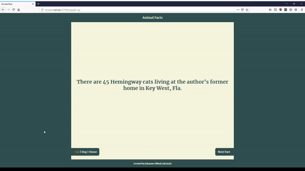

# Animal Facts

## Why and what
This is a responsive website that retrieves facts about various animals from an API and displays them with smooth typing animations. This is created as an excercise in the course `DA344A - Web Applications for Mobile Devices` at Malmö University.

Demo page is available here: http://dvwebb.mah.se/ah7948/uppgift-vg/



## Tools
These tools are used to accomplish this project.

* Javascript is compiled using [Webpack](https://github.com/webpack/webpack)
* Animations are done with [animejs](https://github.com/juliangarnier/anime/)
* Ajax requests are done with [axios](https://github.com/axios/axios)

## How to run it
1. Clone the github repository
2. `(Optional)` Change the CORS proxy. Since the cat-facts-api I am using in this project does not allow Cross-Origin Resource Sharing I have decided to use a proxy. Setting up your own proxy is recommended. To change the proxy change the `api variable` in `src/CatFactsApi.js`
3. Install build requirements:
```
npm install
```
4. Build the website:
```
npm run-script build
```
5. Copy everything inside the dist/ directory to a webserver. Since it is a completly static website it should now be accessible and provide you with facts about animals.

## License
This project is licensed under the GPLv3. See `LICENCE` file in the code for details.
